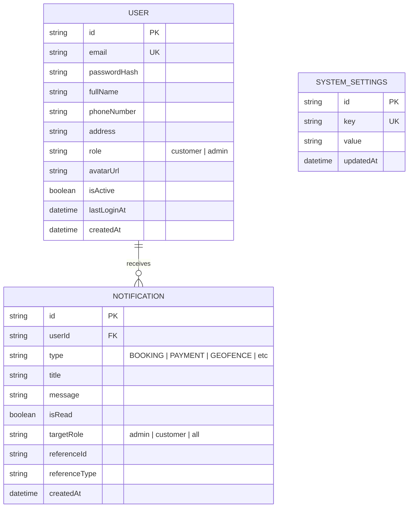
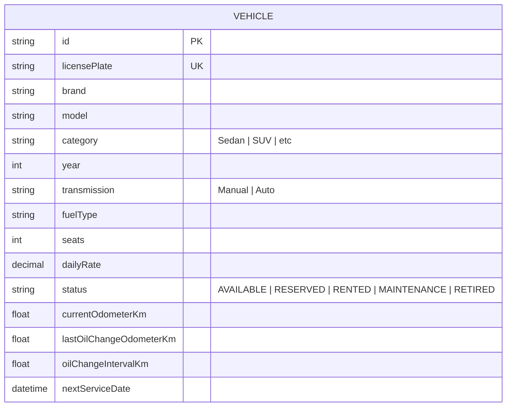
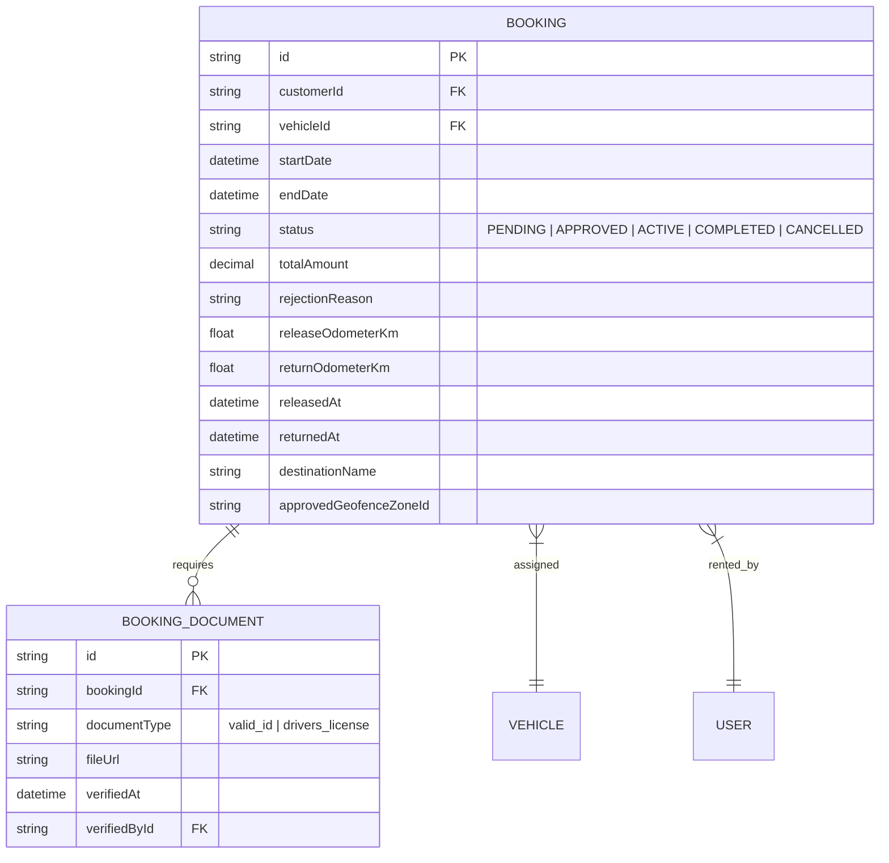
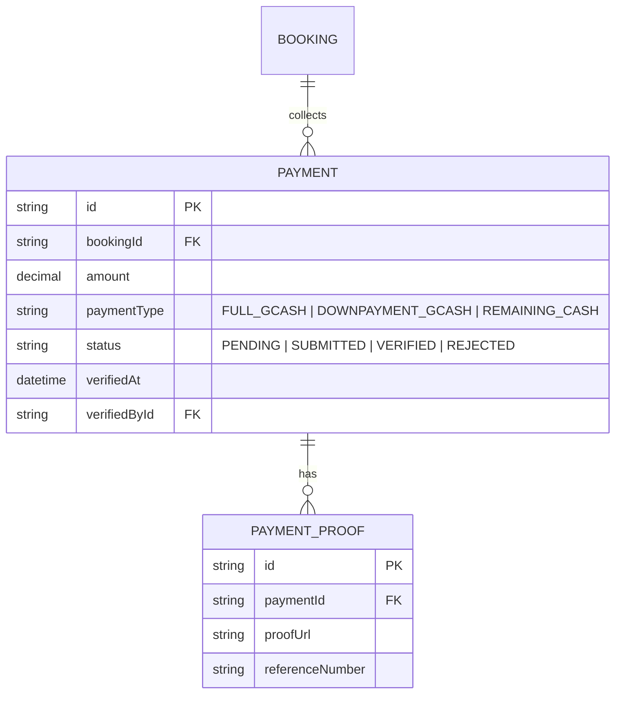
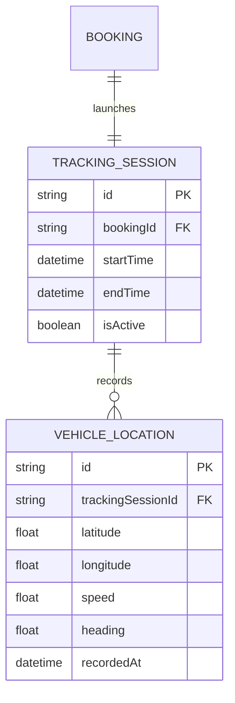
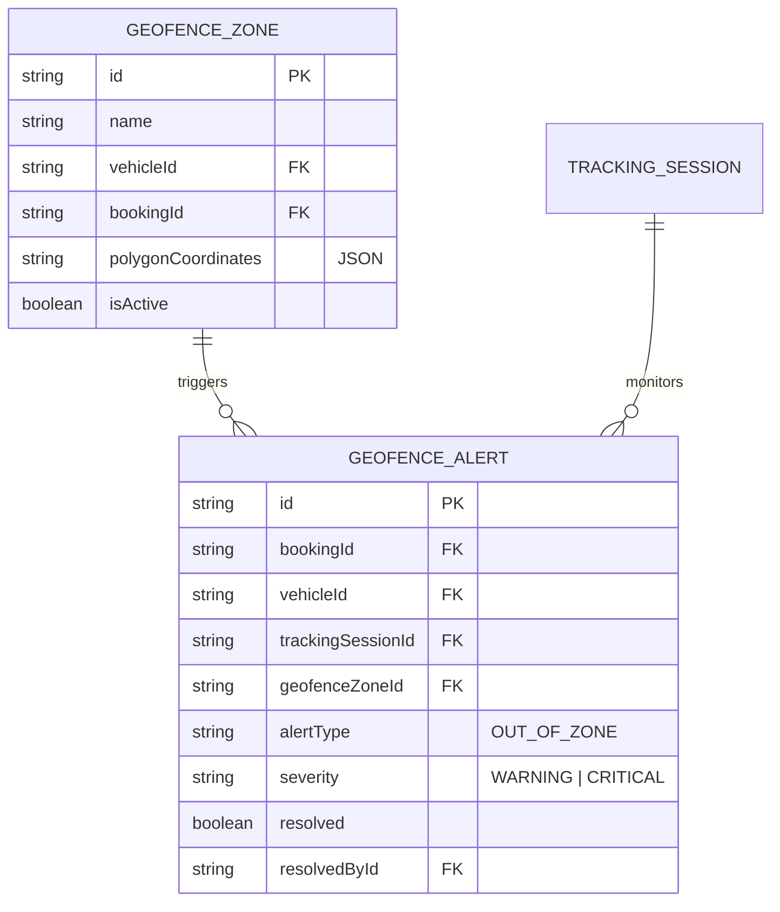
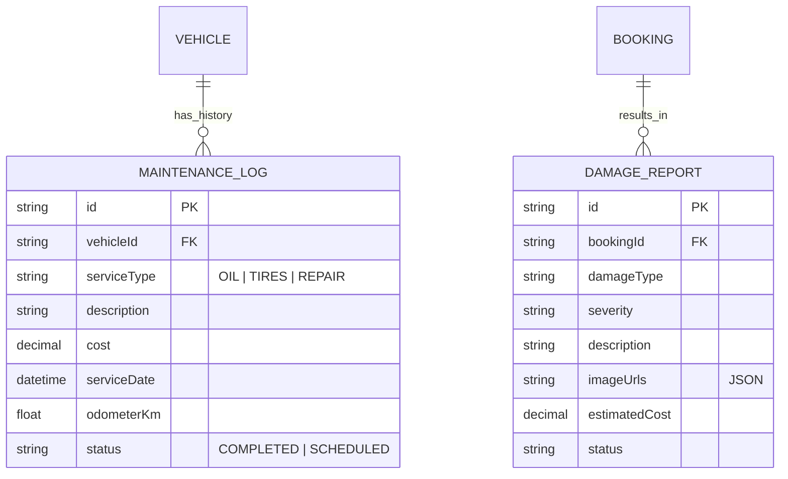
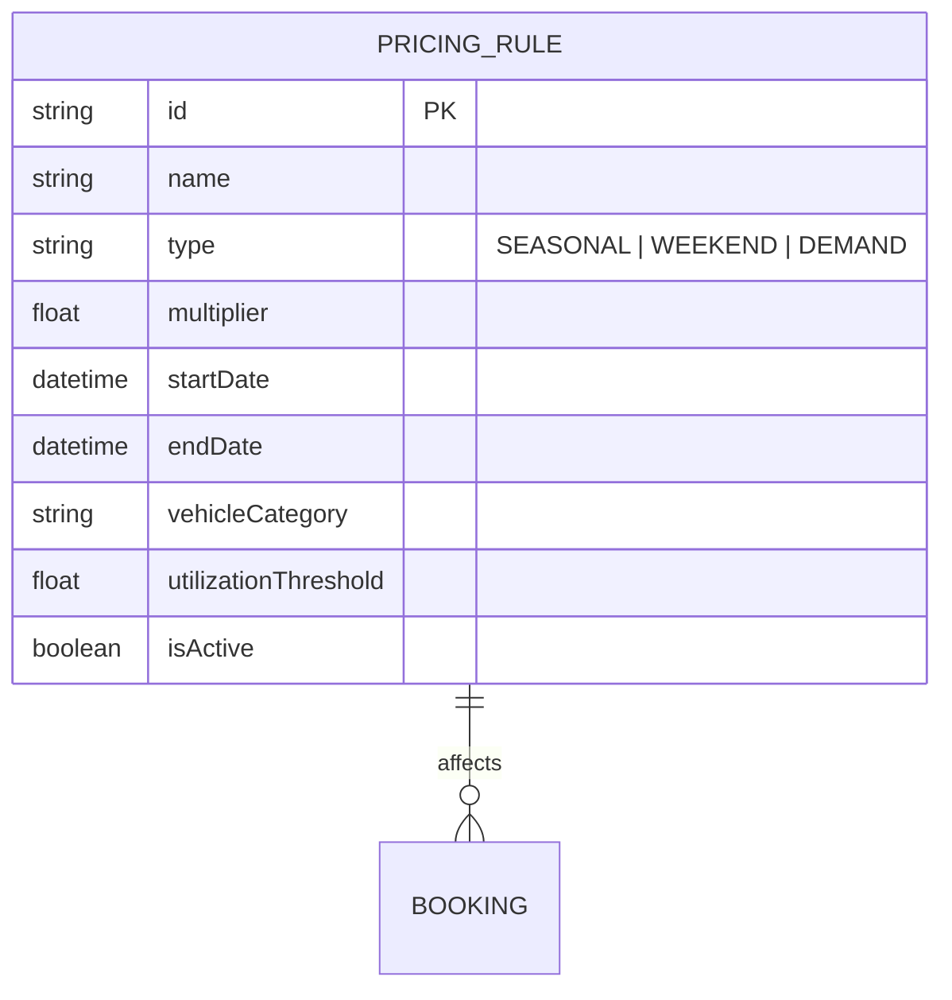

# Module ERD Diagrams (System Aligned)

This document contains specialized Entity Relationship Diagrams (ERDs) for each core module of the JD Car Rental system. These diagrams are synchronized with the **actual system schema** in [Prisma Schema](../server/prisma/schema.prisma).

## 1. User & Authentication Module
Manages user roles, telemetry settings, and notifications.

## 2. Vehicle Fleet Management
Inventory of vehicles including technical specifications and basic maintenance stats.

## 3. Booking Lifecycle & Rental Process
Core rental logic including pickups, returns, and digital documentation.

## 4. Secure Payments
Payment processing, GCash verification, and transaction history.

## 5. Tracking & Telemetry
Active GPS session management and location history.

## 6. Geofencing & Security Alerts
Boundary management and real-time breach notifications.

## 7. Maintenance & Repairs
Vehicle health logs and damage reporting.

## 8. Dynamic Pricing
Market-based pricing rules and multipliers.

